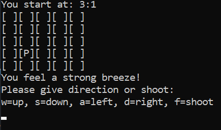
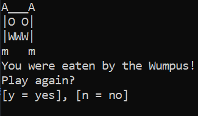
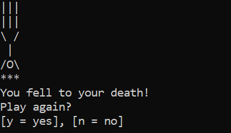
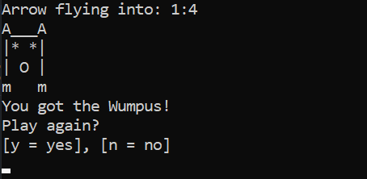

# HuntTheWumpus_Java_Files
Java files for Hunt the Wumpus game

Developed by Joni Honkanen

## General
This code is a simple implementation of the Hunt the Wumpus game.
Code includes a simple menu functions, gameplay loop and simple end game graphics.
This code can be run on command line.

## Images

  
  
  
  

## Project implementation
Parts of this code have been implemented in another project.
The application runs on Pepper Robot.

## Screencast for the implementation (in Finnish):
https://youtu.be/hNDG3LvVapc
